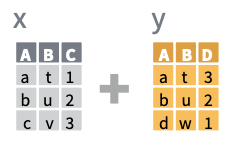
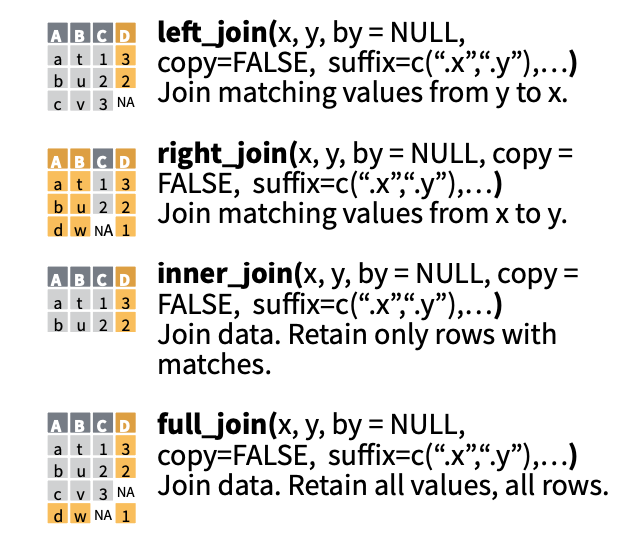

```{r setup, include=FALSE}
knitr::opts_chunk$set(echo = TRUE,fig.height = 4,fig.width = 5, message=F)

library(dplyr)
library(tidyr)
library(knitr)

df_wide <- data.frame(row = LETTERS[1:3], a = 1:3, b = 4:6, c = 7:9)
df_long <- gather(df_wide, key = key, value = value, -row)
```


## Today's Topics:
<style type="text/css">
pre {
  font-size: 14px
}
</style>

> - Tidyverse packages
> - Long vs. wide data
> - Merging multiple data sources
> - Cleaning data
> - Creating new variables

```{r, out.width = "400px",echo=F}
knitr::include_graphics("hadley-wickham.jpg")
```

## Tidyverse

- Packages developed at RStudio    
    + ggplot2, dplyr, tidyr, readr, purrr, tibble, stringr, forcats
- Designed to make data cleaning effecient and readable
- Introduces the Pipe Operater `r paste("%>%")`

```{r eval=F}
## foo_foo is an instance of a little bunny
foo_foo <- little_bunny()

## adventures in base R must be read from the middle up and backwards
bop_on(
    scoop_up(
        hop_through(foo_foo, forest),
        field_mouse
    ),
    head
)

## adventures w/ pipes start at the top and work down
foo_foo %>%
    hop_through(forest) %>%
    scoop_up(field_mouse) %>%
    bop_on(head)
```


## Long vs Wide Data
<style>
.container{
    display: flex;
}
.col{
    flex: 1;
}
</style>

<div class="container">

<div class="col">
- Long data best for analysis
- Wide data often used for display purposes
- Transition between them with a key/value pair    
    + Key is a grouping variable
    + Value is a measurement
</div>

<div class="col">
```{r, echo=F}
# WIDE
paste("WIDE")
df_wide

# LONG
paste("LONG")
df_long
```
</div>

</div>


## Joining Multiple Data Sets

<!-- {height=30%}   -->
<!-- {height=50%} -->

```{r joins, echo=F, fig.align = 'center'}
knitr::include_graphics(c("joins1.png","joins2.png"))
# #
```

[RstudioCheatsheets](https://github.com/rstudio/cheatsheets)

